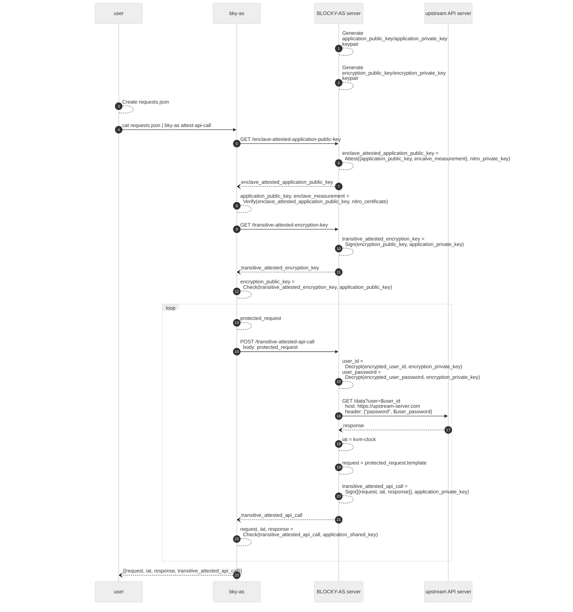

> :exclamation: The BLOCKY Attestation Service Demo is provided with no
> guarantees. By trying out this demo or invoking the `bky-as` executable you
> agree to not hold BLOCKY responsible for any problems, mishaps,
> adverse effects, or frustrations.

# BLOCKY Attestation Service

BLOCKY Attestation Service (BLOCKY-AS) allows you to create attestations over
responses from web APIs. BLOCKY-AS attestations allow you to prove to a third
party that a specific API returned specific data at a particular point in time.

## Quick Start

To request and inspect your first attestation, follow these steps:

1. Install the BLOCKY-AS CLI

```bash
curl -s https://raw.githubusercontent.com/blocky/attestation-service-demo/main/install.sh | bash
```

2. Request an attestation with a API request template. Here we are creating an
   attestation over a trivia question and answer from
   [Open Trivia Database](https://opentdb.com/).

```bash
echo '[{ "template": { "method": "GET", "url": "https://opentdb.com/api.php?amount=1" } }]' | \
	./bky-as attest-api-call > out.json
```

3. Inspect the attested API response

```bash
jq '.api_calls[0].claims.response.body | @base64d | fromjson' out.json
```

If you see a `"response_code": 5`, it means you hit the rate limit of the
[Open Trivia Database](https://opentdb.com/) API. Thanks for trying the demo
multiple times!

**NOTE:** This quick start demo started a **local instance** of the BLOCKY-AS
server,
which does __NOT__ run in a Trusted Execution Environment (TEE).
For access to BLOCKY-AS deployed on
production TEE servers, reach out to
[info@blocky.rocks](mailto:info@blocky.rocks).

## Installation

To install the BLOCKY-AS CLI, run the following command:

```bash
curl -s https://raw.githubusercontent.com/blocky/attestation-service-demo/main/install.sh | bash
```

The installation script will check your system architecture, operating system,
and download the appropriate `bky-as` executable. If you prefer, you can move
`bky-as` to another location in your `$PATH`.
The script will also download a configuration file called
`config.toml`. The `bky-as` command will look for it
in the current directory, `./configs`, `$HOME/.config/bky/bky-as` or you can
specify the location using the `--config` command line argument.

To test the installation and see available commands, run:

```bash
bky-as --help
```

## Configuration

The starting `config.toml` uses `local-server` as the host, which
directs `bky-as` to start a local server that does **NOT** run in a TEE.
As a result, the attestations produced by a local server are not suitable
for production use.

To use BLOCKY-AS in production, contact
[info@blocky.rocks](mailto:info@blocky.rocks) for:

- The URL of a production BLOCKY-AS server running inside a TEE. You will need
  to set it as the `host` value in `config.toml`.
- A developer token for accessing the BLOCKY-AS server. You will
  need to set it as the `auth_token` value in `config.toml`.
- A measurement of the source code running on the TEE.
  You will need to add it to the `acceptable_measurements` values in
  `config.toml`.
  This setting allows you to define what version of the BLOCKY-AS code you
  trust. Please consult the [Enclave Measurements](#enclave-measurements)
  section for more information.

After you set these values in `config.toml`, you'll be able to obtain
attestations that anyone can verify without trusting you or BLOCKY.

## Request Templates

BLOCKY-AS uses TEEs to transform a set of
[request templates](#request-templates) into API requests and return a
set of [attestations](#attestations) over API responses.
The template allows you encrypt sensitive data that can
be decrypted by the TEE only.
In other words, even BLOCKY cannot see that data.

To demonstrate that capability, let's fetch the current weather of BLOCKY's
Headquarters in Bozeman, Montana, or whatever location you prefer.
You will need an API key from the weather API. You can get a free API key from
the [Tomorrow API](https://app.tomorrow.io/signin).

Next, create a collection of request templates as `requests.json`:

```json
[
  {
    "environment": {
      "location": "Bozeman",
      "apikey": "super-secret"
    },
    "template": {
      "method": "GET",
      "url": "https://api.tomorrow.io/v4/weather/realtime?location={{location}}&apikey={{apikey}}&units=imperial",
      "body": {},
      "header": {
        "Content-Type": [
          "application/json"
        ]
      }
    }
  }
]
```

In each request template, just one in the above example, you specify:

- `environment` (optional)
   - A collection of variables to use in the template. The variables can contain
     secrets for accessing the API, or other information you do not want to leak
     to BLOCKY, or to the third parties that verify BLOCKY-AS attestations.
     This variables will be encrypted by `bky-as` and decrypted by the server.
- `template` - (required)
   - The template the BLOCKY-AS server will use to form an API request,
     including:
      - `method` - (required) The HTTP method for the request
      - `url` - (required) The URL template for the request
      - `body` - (optional) The body template of the request
      - `header` - (optional) The header template of the request
   - Note that the `url`, `body`, and `header` fields can all use the variables
     from the `environment` collection. BLOCKY-AS servers use the
     [Mustache](https://mustache.github.io/) syntax in the `template` to
     replace variable names with values from the `environment`.

Finally, update the `environment.apikey` with your API key from
[tomorrow.io](https://docs.tomorrow.io).

## Attestations

To obtain BLOCKY-AS attestations using the request templates in `requests.json`,
run:

```bash
cat requests.json | ./bky-as attest-api-call > out.json
```

The resulting `out.json` contains the attestations for each templated request.
Diving deeper into the structure of `out.json` with `jq`,

```bash
cat out.json | jq keys
```

shows that `out.json` contains

```json
[
  "api_calls",
  "enclave_attested_application_public_key"
]
```

Let's go deeper into the `enclave_attested_application_public_key` and run

```bash
cat out.json | jq '.enclave_attested_application_public_key'
```

which produces data with the following structure:

```json
{
 "Platform": "nitro",
 "PlAttests": [
   "hEShATgioFkUq6...",
   "hEShATgioFkRHa...",
 ]
}
```

- `PlAttests` contains platform attestations created by the TEE hardware
   module.  The platform attestations collectively attest a serialized
   *application public key* that is specific to an instance of a BLOCKY-AS server.
- `Platform` contains type of the platform on which the BLOCKY-AS server runs.
   If you are running the demo using `local-server` in `config.toml`, the
   `"Platform": "plain"` indicates that the server is not running in a TEE.

Next, let's inspect the `api_calls`. In general, the _i_-th entry of
`api_calls` in `out.json` corresponds to the _i_-th
request in `requests.json`. Here, we have only one request, so we have only one
response.  Let's explore the response.

```bash
cat out.json | jq '.api_calls[0] | keys'
```

shows that it contains

```json
[
  "claims",
  "transitive_attestation"
]
```

But what are these things? Let's discuss them.
Recall that each instance of BLOCKY-AS has a unique application
public key with an associated private key.  We use that public key to sign
data, which we call *claims*. We call the data structure containing the claims,
the signature, and other information needed for checking the signature a
*transitive attestation*.  (In fact, transitive attestations follow the
[JWT](https://jwt.io) standard.)

In the context of BLOCKY-AS making an API call, we create a
transitive attestation where the claims are the fields needed
for interpreting and proving the authenticity of an API call.
These fields include the request template, the upstream API server's
response, and a certificate chain among others.

Now, let's see how we use this transitive attestation in practice.
When we call `bky-as attest-api-call`, it performs four steps.
First, it verifies the `enclave_attested_application_public_key`.
Second, it extracts the application public key.
Third, it uses the public key to verify the `transitive_attestation`.
Fourth, it extracts the request and response data from the
`transitive_attestation` as `claims`.

These claims contain the request template in `request`, the time at which the
request was issued at, `iat`, and of course, the `response` including the HTTP
`status_code`, response `body` as well as other data.

We can see the response body with the following command:

```bash
cat out.json | jq -r '.api_calls[0].claims.response.body' | base64 -d | jq .
```

Now, let's say that you want to archive BLOCKY-AS attestations for later, or
send them to a third party for verification. You can store the
`enclave_attested_application_public_key` and `transitive_attestations`
individually in an archival system of your choice, or package them up in a
single file `to-verify.json` with:

```bash
jq '{
    enclave_attested_application_public_key: .enclave_attested_application_public_key,
    transitive_attested_api_calls: [ .api_calls[] | .transitive_attestation ]
    }' out.json > to-verify.json
```

You, or a third party, can at verify this collection with `bky-as` by running:

```bash
cat to-verify.json | ./bky-as verify > verified.json
```

Again you can use `jq` to explore the results, but you will find that
`verified.json` is identical to `out.json`. You can double-check that by
running:

```bash
diff out.json verified.json
```

which will show no output, indicating that contents of the files are the same.

## Enclave Measurements

The foundation of the BLOCKY-AS security model relies on two axioms:

1. BLOCKY-AS service runs inside a TEE
2. The TEE runs a specific version of the BLOCKY-AS service

The current version of BLOCKY-AS runs on
[AWS Nitro Enclaves](https://aws.amazon.com/ec2/nitro/nitro-enclaves/).
You can read more about The Security Design of the AWS Nitro
System, including AWS Nitro Enclaves
[here](https://docs.aws.amazon.com/pdfs/whitepapers/latest/security-design-of-aws-nitro-system/security-design-of-aws-nitro-system.pdf).
Specifically, we rely on the correctness of AWS Nitro Enclaves implementation
and on the ability of AWS to retain the control over the private key used by the
AWS Nitro Enclaves hardware security module to sign the
`enclave_attested_application_public_key`.
Future versions of BLOCKY-AS will support multiple TEE hosting options,
including [AMD SEV](https://www.amd.com/en/developer/sev.html) and
[Intel TDX](https://www.intel.com/content/www/us/en/developer/tools/trust-domain-extensions/overview.html)
architectures.

An `enclave_attested_application_public_key` attests not only the application
public key, but also the enclave image, which,
can be used to represent the source code, build process, and runtime
environment of the application.

In the near future, we will make the source code of BLOCKY-AS available for
inspection, which will allow you to build your own enclave image and compare
its measurement to the one attested by the enclave. For now, we provide the
measurement to enter into your `config.toml` file.
In the future, you will be able to compute this value yourself and know what
code produces the attestations you receive.

## Protocol

For a final deep dive, let's explore the protocol used in BLOCKY-AS.

You can interact with BLOCKY-AS in the same way in which you would any other API
server. You can use CLI tools like `curl`, platforms like `postman`, or language
specific libraries like `requests` in python. We chose that design so that
anybody can integrate BLOCKY-AS into their system in a way that works best for
them. However, implementing the protocol requires some developer effort.

We have a few Go libraries that we use for testing. We used those
libraries to build a tool called `bky-as` that does most of the work for
you. And, since it is written in Go, we can build static binaries that you can
use on your system, use in a CI/CD pipeline, or in production.

The figure below shows the details of the interactions between a user,
`bky-as`, the BLOCKY-AS server running on a TEE, and an upstream API server.



1. The BLOCKY-AS server generates the `application_public_key`/`application_private_key`
   on startup. The server will use the `application_private_key` to sign
   transitive attestations.
2. Also on startup, the BLOCKY-AS server generates the
   `encryption_public_key`/`encryption_private_key` keypair. The server will
   use `encryption_private_key` to decrypt elements of the
   `encrypted_environment`.
3. The user creates `requests.json` containing an array of requests:

    ```
    [
      {
        "environment": {
          "user-id": "secret_user_id",
          "user-password": "secret_password"
        },
        "template": {
          "method": "GET",
          "url": "https://upstream-server.com/data?user={{user-id}}",
          "header": {
            "password": "{{user-password}}"
          }
        }
      }
    ]
    ```

   where `environment` specifies user secrets and `template` specifies the
   template for the HTTP request.  The server will render the request
   from the template and the decrypted environment.

4. The user pipes `requests.json` to `bky-as attest-api-call` to obtain
   a transitive attested API call.
5. `bky-as` issues a `GET` request to the BLOCKY-AS server
   `/enclave-attested-application-public-key` endpoint.
6. The BLOCKY-AS server creates an `enclave_attested_application_public_key`,
   which contains the
   `application_public_key` and the `code_measurement` of the BLOCKY-AS code
   running on the enclave and is signed by the AWS Nitro private key.
7. The BLOCKY-AS server replies with the
   `enclave_attested_application_public_key` to the `bky-as`
   CLI.
8. `bky-as` verifies the `enclave_attested_application_public_key` using the AWS
   Nitro
   Enclave well-known
   [
   `nitro_certificate`](https://docs.aws.amazon.com/enclaves/latest/user/verify-root.html#validation-process)
   and extracts the `applicaiton_public_key` and the `code_measurement`.
   Moreover, it verifies that the
    `enclave_attested_application_public_key.code_measurement` is
    on the list of `acceptable_measurements` in `config.toml`.
9. To obtain the `encryption_public_key`, `bky-as` issues a `GET`
   request to the BLOCKY-AS server `/transitive-attested-encryption-key` endpoint.
10. The BLOCKY-AS server creates a `transitive_attested_encryption_key`, which
    is a JWT containing the
    `encryption_public_key` signed with the `application_private_key`.
11. The BLOCKY-AS server replies with the `transitive_attested_encryption_key`
    to the `bky-as` CLI.
12. `bky-as` checks the signature of `transitive_attested_encryption_key` using the
    `application_public_key` to extract the `encryption_public_key`.
13. For each `request`, `bky-as` encrypts elements of its `environment`
    using the `encryption_public_key`

```
encrypted_user_id = Encrypt("secret_user_id", encryption_public_key)
encrypted_user_password = Encrypt("secret_user_password", encryption_public_key)
```

to create an encrypted environment (`encr_env`) and a `protected_request`:

```
{
  "encr_env": {
	 "user-id": encrypted_user_id,
	 "user-password": encrypted_user_password
  },
  "template": {
	 "method": "GET",
	 "url": "https://upstream-server.com/data?user={{user-id}}",
	 "header": {
		"password": "{{user-password}}"
	 }
}
```

14. To obtain a `transitive_attested_api_call`, `bky-as` issues a `POST` request to
    the BLOCKY-AS server `/transitive-attested-api-call` endpoint with
    the `protected_request` in the `body`.
15. The BLOCKY-AS server uses the `encryption_private_key` to decrypt the
    elements of the `encr_env` in the `protected_request`

```
user_id = Decrypt(encrypted_user_id, encryption_private_key)
user_password = Decrypt(encrypted_user_password, encryption_private_key)
```

16. The BLOCKY-AS server renders an HTTP request from the `template` and decrypted
    elements of the `encr_env` and makes the HTTP request to an upstream API server.
17. The BLOCKY-AS server collects the upstream API server reply, and prepares
    a `response` claim, which contains the status code, headers, body, and the
    upstream server certificate chain.
18. The BLOCKY-AS server obtains a timestamp from the enclave's
    NTP-synchronized `kvm-clock` to prepare the "Issued At" `iat` claim.
19. The BLOCKY-AS server prepares a `request` claim, which is set to the value
    of `protected_request.template`.
20. The BLOCKY-AS server creates a `transitive_attested_api_call`, which is a
    JWT over the `request`, `iat`, and `response` claims
    signed with the `application_public_key`.
21. The BLOCKY-AS server returns the `transitive_attested_api_call`.
22. `bky-as` checks each `transitive_attested_api_call` using the `application_public_key`
    and extracts the `request`, `iat`, and `response` claims corresponding to
    each `protected_request`.
23. `bky-as` returns to the user the array of `request`, `iat`,
    and `response` claims corresponding to each `transitive_attested_api_call`.
